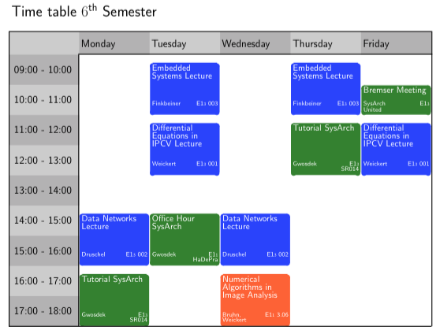

# Timetable

## How it's going to look like

An example how a timetable created with this LaTeX package (v.1.41) looks like:

## Overview

This is the latest version 1.41 of a LaTeX package for creating one-week timetables as they are frequently needed in universities or schools.

## Website

More information can be found online on the project website <http://www.planetk.de/index.php?title=Stundenplan>.

## Usage

You can compile the timetable to PDF via LaTeX and PostScript:

    latex example.tex && dvips example.dvi && ps2pdf example.ps

and directly with pdfLaTeX

    pdflatex example.tex

## License

The timetable LaTeX style sheet is free software. You can redistribute and/or modify it under the terms of the GNU General Public License as published by the Free Software Foundation. You may use version 3 of the license, or (at your option) any later version.

If you decide to redistribute this package, please leave the name of the original author, Pascal Gwosdek, in the header of the file or move it into a file AUTHORS.

